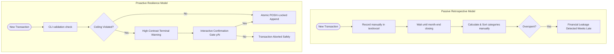

# 📋 **OrcaLogy — Eliminating Manual Budget Slippage & Category Analysis Fatigue**

### **High-Performance Local-First State-Managed Budget Ledger CLI & TUI**

[](https://www.python.org)
[](https://en.wikipedia.org/wiki/Hexagonal_architecture_(software))
[](https://en.wikipedia.org/wiki/Domain-driven_design)
[](https://en.wikipedia.org/wiki/Test-driven_development)

---

## **🏛️ Repository Metadata & Context**

| Property               | Description                                                                              |
| :--------------------- | :--------------------------------------------------------------------------------------- |
| **Role**               | Core Repository Architecture / Project Lead                                              |
| **Target Segment**     | Developers, Tech Professionals & Small Teams (CLI-centric & Local-first Users)           |
| **Architecture Style** | Hexagonal (Ports & Adapters) & Domain-Driven Design (DDD)                                |
| **Execution Engine**   | Plain-Text Journal Ledger with Advisory POSIX Locking and Atomic temporary-swap writes   |
| **Date of Creation**   | June 15, 2026                                                                            |
| **Current Version**    | v0.1.0                                                                                   |

---

## **🚀 1. The Product Vision & Core Problem**

### **1.1. The Macro Pain Space**

Traditional personal finance tools operate under a cloud-first "Happy Path" model, requiring constant internet connectivity, third-party bank integration webhooks, and complex SaaS subscriptions. Privacy-conscious developers, system operators, and small teams often resort to local plain-text ledger files or custom spreadsheet configurations. 

However, these legacy workarounds introduce **severe cognitive fatigue** and **stealth financial leakage**:
- **Manual Computation Fatigue:** Users spend 3 to 5 hours at the end of each month manually parsing transaction logs, calculating cumulative category spending, and executing manual sorting algorithms to identify budget overruns.
- **Delayed Spending Visibility:** In the absence of real-time validation, users overrun critical category limits, discovering the damage only weeks later during month-end closing.
- **Data Integrity Failures:** Unprotected flat files or formula-heavy spreadsheets are highly susceptible to silent formatting corruption, race conditions from concurrent terminal windows, and lacks a secure state-managed budget lifecycle.

### **1.2. The Core Solution Paradigm Shift**

**OrcaLogy** resolves this friction by introducing an offline-first, terminal-centric budget management engine. Instead of retrospective auditing, OrcaLogy implements a **proactive validation state machine** directly on top of human-readable plain-text transaction files.

*   **Field 1.3 - Strategic Paradigm Shift:** Transitioning personal finance from passive post-month manual compilation to real-time entry validation. The CLI acts as a gatekeeper, warning users immediately when a transaction will violate a category limit and forcing an explicit confirmation before writing to the ledger.



To guarantee business integrity and mathematical correctness, OrcaLogy implements a **0% float inaccuracy SLA** by wrapping all financial variables in an immutable `Money` Value Object leveraging Python's `decimal.Decimal` module.

---

## **🎮 2. CLI / Interface Usage Reference**

The client interface is designed for maximum keyboard efficiency. Use the following core execution commands:

| Command / Action              | Syntax                                                        | Description                                                                      | Example                                              |
| :---------------------------- | :------------------------------------------------------------ | :------------------------------------------------------------------------------- | :--------------------------------------------------- |
| **Initialize Budget**         | `orca init`                                                   | Interactive prompt to create a monthly budget and set category limits.           | `orca init`                                          |
| **Add Transaction**           | `orca add -c <cat> -a <val> -d <desc> --date YYYY-MM-DD`     | Registers a transaction; triggers real-time limit validation with overrun gate.  | `orca add -c Leisure -a 150.00 -d "Concert" --date 2026-06-16` |
| **Budget Status**             | `orca status --month YYYY-MM`                                 | Quick one-screen snapshot: total spent, remaining, overrun count, cycle state.   | `orca status --month 2026-06`                        |
| **Deviation Report**          | `orca report --month YYYY-MM`                                 | Color-coded ASCII table ranking categories by percentage deviation.              | `orca report --month 2026-06`                        |
| **Close Fiscal Cycle**        | `orca close --month YYYY-MM`                                  | Locks the budget cycle for the month, blocking any further transactions.         | `orca close --month 2026-06`                         |

> [!NOTE]
> **Data & Validation Rules:**
>
> - **Input Sanitization:** Expense amounts must be positive numbers. Zero-amount transactions are blocked.
> - **Deterministic Formats:** Dates must comply with ISO 8601 `YYYY-MM-DD` format. Category names are parsed case-sensitively to avoid spelling duplication (e.g., `Lazer` vs `lazer`).

---

## **🛠️ 3. Technical Stack Overview**

The engineering design balances localized execution speed, offline data safety, and high-fidelity terminal interactions.

| Architectural Layer        | Component / Technology                        | Technical Rationale                                                                       |
| :------------------------- | :-------------------------------------------- | :---------------------------------------------------------------------------------------- |
| **Frontend Client**        | Python `Textual` & `Typer`                    | `Textual` renders a rich, responsive CSS-styled TUI. `Typer` parses CLI flags natively.    |
| **Backend Engine**         | Python 3.11+                                  | Fast development velocity, strict type enforcement via `mypy`, and formatting via `ruff`.  |
| **Concurrency & Safety**    | `filelock` & `os.replace`                     | Enforces POSIX-advisory locks during writes and performs atomic temporary-file swaps.      |
| **Database & Ledger**      | Standardized Plain-Text Ledger File           | Append-only human-readable format (`ledger.journal`), ensuring full data portability.     |

---

## **🏗️ 4. Core Architectural Premises**

*   **Premise 4.1 - Design & Modularity Strategy:** Hexagonal Architecture isolates the core business logic from outer infrastructure. The `orcalogy/domain` module remains a pure computational unit containing zero references to file-system, OS, or UI frameworks.
*   **Premise 4.2 - Testing Strategy & Coverage Rule:** Test-First Development (TDD) cycle. No operational business feature is implemented before its corresponding `pytest` suite is committed and verified.
*   **Premise 4.3 - Data Deletion & Auditing Policy:** Immutable append-only transaction ledger. Corrective transactions (e.g., negative offset adjustments) must be appended to rectify errors, preserving a complete historic audit trail.
*   **Premise 4.4 - API Idempotency & Concurrency Strategy:** Advisory lock files (`.ledger.journal.lock`) managed via `filelock` prevent concurrent processes from interleaving text lines or producing dirty writes.

---

## **📂 5. Codebase Structure & Directory Standards**

```text
orcalogy/
├── pyproject.toml              # Dependency & tool configuration (Poetry, pytest, ruff, mypy)
├── README.md                   # Repository Entry Point
├── CLAUDE.md                   # AI assistant reference guide
├── orcalogy/                   # Main Application Source
│   ├── __init__.py
│   ├── main.py                 # CLI entry point (exposes Typer app)
│   ├── bootstrap.py            # Dependency Injection Container
│   ├── cli/                    # CLI Commands (Typer Interface)
│   │   ├── __init__.py
│   │   └── commands.py         # init, add, report, close, status commands
│   ├── tui/                    # TUI Dashboard (Textual Interface) [in progress]
│   │   ├── __init__.py
│   │   ├── app.py
│   │   └── screens.py
│   ├── app/                    # Application Use Cases
│   │   ├── __init__.py
│   │   └── services.py         # InitializeBudget, RegisterTransaction, Ranking, Close
│   ├── domain/                 # Bounded Domain Context (zero framework imports)
│   │   ├── __init__.py
│   │   ├── models.py           # Money, BudgetCategory, Transaction, Budget aggregate
│   │   ├── ports.py            # ILedgerRepository protocol
│   │   ├── validation.py       # Deterministic limit validator
│   │   ├── ranking.py          # Category deviation sorting math
│   │   └── errors.py           # Domain exception hierarchy
│   └── infra/                  # Infrastructure Adapters (I/O, OS, File Repo)
│       ├── __init__.py
│       ├── file_repo.py        # Atomic flat-file repository
│       ├── parser.py           # Lexical journal file parser
│       └── locker.py           # Advisory concurrency lock manager
└── tests/                      # Testing Suites (70+ tests, TDD-first)
    ├── __init__.py
    ├── conftest.py             # Shared pytest fixtures (tmp_repo)
    ├── test_domain.py          # Domain unit tests
    ├── test_infra.py           # File locking & atomic write integration tests
    ├── test_app.py             # Application use case tests
    ├── test_ports.py           # ILedgerRepository protocol tests
    └── test_cli.py             # CLI command integration tests
```

---

## **💻 6. Local Engineering Development Setup**

### **6.1. Core System Prerequisites**

- Python 3.11+ Installed
- Poetry (Recommended package manager) or standard `pip`

### **6.2. Initial Bootstrap Sequence**

1. Clone this repository locally to your workspace:
   ```bash
   git clone https://github.com/your-org/orcalogy.git
   cd orcalogy
   ```

2. **Step 6.2.1 - Install Dependencies:**
   ```bash
   poetry install
   ```

3. **Step 6.2.2 - Initialize System Files:**
   Create your first monthly budget interactively:
   ```bash
   poetry run orca init
   ```

4. **Step 6.2.3 - Launch TUI Dashboard** *(coming soon — TSK-27/28/29)*:
   ```bash
   poetry run orca tui
   ```

### **6.3. Automated Verification Commands**

Ensure your modifications pass the quality gates before opening a Pull Request:

- **Execute unit and integration tests**:
  ```bash
  poetry run pytest
  ```

- **Verify type definitions strictly**:
  ```bash
  poetry run mypy orcalogy/
  ```

- **Check code styles & lint rules**:
  ```bash
  poetry run ruff check .
  ```

---

🏁 **End of Document:** This repository README serves as the definitive engineering portal for the OrcaLogy ecosystem. Changes to stack versions, core patterns, or installation requirements must follow official pull-request governance.

Made with ❤️ by **Kalyel N. Laurindo / Software Engineer**
