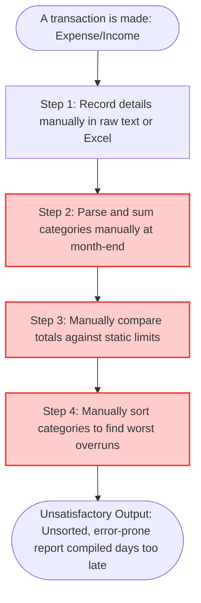

**📋 Product Discovery Document: OrcaLogy — Eliminating Manual Budget Slippage and Category Analysis Fatigue**

**Role:** Product Owner / Product Manager

**Objective:** Investigate, map, and deeply understand the customer's core pain points and the current "As-Is" operational friction before designing any technical solution.

**Context:** OrcaLogy — A manual, high-friction personal and team budget management workflow characterized by untracked category overruns, delayed spending visibility, and complex manual computations to rank financial performance at the end of each fiscal cycle.

## **🏛️ Project Metadata**

- **Client / Segment:** Tech Professionals, Developers, and Small Teams (CLI-centric & Local-first Users)
- **Date of Creation:** June 15, 2026
- **Lead Product Owner:** Kalyel N. Laurindo / Project Owner
- **Document Version:** v1.1
- **Discovery Input Source:** Technical User Interviews, Personal Finance Workaround Logs, and Manual Spreadsheet Audits

## **1. 🎯 The Core Problem (Macro Pain Point)**

### **💡 Understanding the Macro Pain**

The Macro Pain in manual personal finance is not the lack of a modern, flashy mobile application; it is the **stealth financial leakage** and **severe cognitive fatigue** of manually categorizing, tracking, and ranking budget deviations across multiple life domains. Without automation, users suffer from a complete lack of real-time constraint enforcement, realizing they overspent only weeks after the damage has occurred.

### **🧩 Formulation Framework: The Macro Pain Formula**

- **Direct/Local-first Budgeters** (Persona) spend **3 to 5 hours at the end of every month manually consolidating transaction logs and sorting categories by deviation percentages** (Bottleneck) during the **monthly financial closing cycle** (Frequency/Context), which **leads to recurring budget overruns of** $15\%$ **to** $25\%$ **due to late detection, causes persistent anxiety regarding savings targets, and results in direct financial leakage** (Impact).

### **🔍 Validation Guardrails: Symptom vs. Macro Pain vs. Solution**

| **Problem Layer**                      | **False/Weak Statement**                                                                                                                                         | **Technical Explanation**                                                              | **Correct Concept**                                                   |
| -------------------------------------- | ---------------------------------------------------------------------------------------------------------------------------------------------------------------- | -------------------------------------------------------------------------------------- | --------------------------------------------------------------------- |
| **Symptom** _(The Surface Effect)_     | "Our spreadsheet macros crash when parsing CSV files from bank exports."                                                                                         | This is a mechanical symptom, not the core human/business pain.                        | Unstable and slow manual log consolidation.                           |
| **Solution** _(The Future State)_      | "We need an interactive terminal dashboard with instant SQLite storage."                                                                                         | Preemptively defines the solution, bypassing active pain analysis.                     | (To be proposed and designed during the Solution Architecture phase). |
| **Root Cause** _(The Technical "Why")_ | "There is no CLI library mapping category limits directly to standard input streams."                                                                            | A technical dependency gap, not the customer's active operational pain.                | Absence of standardized local validation schemas for spending.        |
| **Active Macro Pain**                  | **"Users operationalize budgets blindly, exceeding critical limits because calculating category overruns and ranking bad performance requires manual sorting."** | **Focuses entirely on cognitive overload, delayed visibility, and financial leakage.** | **This is the Macro Pain that belongs in this section.**              |

### **✍️ Step-by-Step Problem Formulation (Form Entry)**

- **Field 1.1 - Affected Persona(s):** Direct/Local-first Budgeters, Developers, and Tech-savvy Operators who manage their spending via local files and text streams.
- **Field 1.2 - Operational Bottleneck:** Manually parsing raw financial transaction inputs, calculating cumulative category spending, comparing actuals against target limits, and performing manual sorting algorithms (e.g., pen-and-paper or manual row swapping in spreadsheets) to identify the worst-performing budget categories.
- **Field 1.3 - Frequency & Context:** At the end of every monthly cycle and during weekly check-ins where spending limits are reviewed.
- **Field 1.3.1 - Trigger Frequency:** Weekly / Monthly.
- **Field 1.3.2 - Operational Impact Velocity:** Cumulative Friction transitioning into an Immediate Blocker (when critical cash reserves are depleted due to unnoticed overruns).
- **Field 1.4 - Direct Negative Impact:** Significant financial leakage (average of $\$150$ to $\$450$ wasted monthly per operator due to unmonitored overruns), cognitive overload, and delayed decision-making (taking up to 7 days post-month-end to compile financial performance).
- **Field 1.5 - Consolidated Macro Pain Statement:** Direct/Local-first Budgeters spend multiple hours manually parsing transaction logs and sorting categories at the end of each month, which delays critical spending insights and results in a chronic $15\%$ budget overrun due to lack of active operational feedback.

### **❓ Situational Diagnostic Verification**

- **Diagnostic Q1:** Who is directly affected by this pain, and where exactly does it occur in the active workflow?
  - _Answer:_ The individual budget manager (developer or operator) is affected directly at the moment of entry validation and during the end-of-month review. The pain is centered in the manual calculation of "actual spending vs. budget limit" and the dynamic sorting of category health.
- **Diagnostic Q2:** Which operational or financial KPIs are actively deteriorating due to this problem today?
  - _Answer:_ Monthly Savings Margin (decreased due to overruns), Time-to-Audit (taking hours of manual calculations), and Budget Adherence Rate (failing to stay within predefined thresholds).
- **Diagnostic Q3:** If no action is taken, what is the worst-case scenario the business/individual will face in 3 to 6 months?
  - _Answer:_ Erosion of personal or small team capital reserves, persistent failure to meet strategic savings or investment goals, and eventual abandonment of financial tracking entirely due to high friction (the "tracking burnout" syndrome).

## **2. 👥 Target Audience: Personas, Micro-Pains, and Emotional States**

### **💡 Mapping the Personas of Pain**

Different user groups experience the same problem from different vantage points. While operational contributors suffer from repetitive manual effort, leadership suffers from poor data integrity and visibility.

| **Persona Name / Role**                                              | **Persona Type**     | **Department / Area**                       | **Core Operational Micro-Pains**                                                                                                                                                                                                                                                                                                                                             | **Current Emotional Sentiment**                                                                                                                    |
| -------------------------------------------------------------------- | -------------------- | ------------------------------------------- | ---------------------------------------------------------------------------------------------------------------------------------------------------------------------------------------------------------------------------------------------------------------------------------------------------------------------------------------------------------------------------- | -------------------------------------------------------------------------------------------------------------------------------------------------- |
| **The Local-First Financial Planner** _(Direct User)_                | Direct User          | Personal Finance / Small Project Operations | • Writing down every daily transaction into text files or unstructured spreadsheets without immediate validation. • Manual overhead of checking if a newly registered expense of $\$50$ violates the specific category budget (requires searching, summing, and evaluating manually). • No quick way to rank which categories are leaking money fastest at any given moment. | Overwhelmed by administrative overhead, anxious about hidden financial leaks, and resistant to heavy, privacy-invasive cloud finance apps.         |
| **The Small Team Lead / Bootstrap Manager** _(Indirect Beneficiary)_ | Indirect Beneficiary | Project Coordination & Bootstrap Operations | • Receiving delayed reports on project operational expenditures (OPEX) from team members. • Inability to see a real-time "performance ranking" of operating categories to decide where to cut costs immediately. • Wasting time in monthly alignment meetings arguing about which budget category overspent the most due to conflicting spreadsheet versions.                | Frustrated by lack of visibility, worried about running out of runway, and looking for immediate, lightweight, and deterministic operational data. |

## **3. 🛠️ Current Workarounds & Shadow IT (Palliative Solutions)**

### **💡 The Power of Workarounds**

Palliative processes and custom hacks are the ultimate validation that a pain is real and urgent. If users spend hours designing complex spreadsheet matrices or typing manual validation terminal pipes, the problem warrants structured attention.

| **Workaround Identifier & Name** | **Workaround Type** | **Operational Process Flow** | **Risk Level** | **Systemic Fragility & Data Risks** |
| :--- | :--- | :--- | :--- | :--- |
| **Workaround 1:** The "Unsorted Plain Text Journal" | Legacy Scripts / Unofficial Logs | 1. User manually writes down transactions in a local text file: `2026-06-15, Food, 25.50, Supermarket`. 2. At month-end, the user opens the file and manually groups entries using command-line commands like `grep "Food" budget.txt | awk '{sum+= $3} END {print sum}'` repeated for every single category. 3. The user manually copies these sums into a second draft file. | **High** | Extremely high risk of syntax errors (e.g., writing "Food " with a trailing space, which bypasses filters), missing transactions, and zero validation for negative account balances at the time of entry. |
| **Workaround 2:** The "Over-Engineered Local Spreadsheet" | Unofficial Spreadsheets | 1. User opens a local spreadsheet containing 12 tabs (one for each month) with hardcoded `SUMIF` formulas. 2. Category spending limits are stored on a separate configuration sheet. 3. To rank performance, the user must manually select the compiled data blocks and execute a "Sort Descending" action. | **Medium** | Formula corruption is a constant risk. If a single row is inserted incorrectly, the `SUMIF` boundaries fail, leading to silent calculation errors that falsify budget limits. Sorting columns manually often breaks row association if not highlighted fully, corrupting historical data. |
| **Workaround 3:** The "Memory-driven Budgeting" | Informal Tracking | 1. User reviews their bank account balance and mentally allocates sub-amounts for food, rent, and leisure. 2. No transaction-level ledger is updated. 3. Budget checking is done by "guessing" how much is left before purchasing. | **Critical** | Total visibility failure. The user has zero historical data, zero category performance metrics, and inevitably overspends by substantial margins, leading to recurring financial emergencies. |

## **4. 🚨 Cost of Inaction (COI) / The Penalty of Inertia**

### **💡 What Happens if We Do Nothing?**

Maintaining the status quo of manual spreadsheets and text-grepping is not free. It has direct, measurable financial and human costs.

- **Field 4.1 - Operational & Productivity Waste:** Operators spend up to $60$ hours per year on manual data entry, manual validation, and spreadsheet sorting. This creates high friction, often resulting in "tracking fatigue" and causing users to skip tracking entirely for weeks at a time, rendering financial planning useless.
- **Field 4.2 - Quality & Output Damage:** Manual calculations introduce a standard human entry error rate of $3\%$ to $5\%$. In personal budgeting, a single missing zero can mask a critical overspend, leading to late-rent fees, overdraft fees, or depleted cash reserves.
- **Field 4.3 - Compliance, Security & Regulatory Risks:** Using third-party cloud tools to automate this often exposes extremely sensitive financial transactions (via open-banking APIs or raw bank statements) to external data brokers. The alternative—unprotected local spreadsheets—lacks data validation and security boundaries, making them prone to accidental deletion without a deterministic ledger audit-trail.

## **5. 🔄 Current State Journey (The "As-Is" Workflow)**

### **💡 Visualizing the Status Quo**

The diagram below maps the current, highly manual workflow of capturing a transaction and compiling performance metrics at the end of the month.

### **✍️ Current Systems & Software Infrastructure Involved**

- **System 5.1 - Core Software/Platforms:** Raw local text editors (VS Code, Vim, Notepad), basic command-line utilities (`grep`, `awk`), and local spreadsheet software (Excel, LibreOffice).
- **System 5.2 - Infrastructure Boundaries:** Completely local-centric file storage. There is no automated transaction piping, no live category validation schema, and no state machine managing the budget's lifecycle.

### **✍️ As-Is Journey Step Entry**

The detailed operational sequences of the manual budget flow highlight the severe structural friction points:

| **Step**   | **Step Title**                       | **Actor / Owner** | **Tools & Systems Involved**                              | **Action Description**                                                                                                                                                                                                                                                                 | **Friction & Bottleneck Level**                              |
| ---------- | ------------------------------------ | ----------------- | --------------------------------------------------------- | -------------------------------------------------------------------------------------------------------------------------------------------------------------------------------------------------------------------------------------------------------------------------------------- | ------------------------------------------------------------ |
| **Step 1** | **Logging the Transaction**          | Direct User       | Text editor or local spreadsheet                          | The user manually opens their tracking file and types the transaction. There are no immediate checks to see if the category exists, if the spelling is correct, or if the user actually has the balance.                                                                               | **Minor Friction** (But highly error-prone).                 |
| **Step 2** | **Mid-Month Budget Checking**        | Direct User       | Calculator, spreadsheet formulas, or custom shell scripts | To know if they can spend money on "Leisure", the user must manually sum all "Leisure" rows in the ledger and subtract them from their target. This is slow, so they often skip it and spend blindly.                                                                                  | 🚨 **Critical Bottleneck** (Forces blind operational spend). |
| **Step 3** | **End-of-Month Performance Sorting** | Direct User       | Excel sorting filters or manual list writing              | The user calculates the deviation of every category: $$\text{Deviation (\%)} = \left(\frac{\text{Actual Spending}}{\text{Budgeted Limit}} - 1\right) \times 100$$ The user then manually re-orders the categories from highest overrun to lowest to understand where their money went. | 🚨 **Critical Bottleneck** (Tedious math done post-factum).  |

## **6. 💰 Quantitative Pain Metrics & Financial Waste**

### **💡 Monetizing the Pain**

The manual system's inefficiency translates directly to financial waste. Below is a rigorous estimation based on average tech professional metrics.

- **Field 6.0 - Metric Context:** Personal Finance / Small Team Project Budgeting

#### **📊 Analytical Formulas:**

- **Cost of Wasted Operational Time:**

  $$\text{Cost of Wasted Operational Time} = (\text{Wasted Hours/Month} \times \text{Operator Hourly Cost}) \times \text{Number of Operators} \times 12$$

- **Cost of Budget Overrun / Leakage:**

  $$\text{Annual Cost of Overruns} = (\text{Average Monthly Overrun due to lack of visibility}) \times 12$$

### **✍️ Financial Waste Metrics Entry**

- **Field 6.1 - Operational Time Loss:**
  - _Wasted Hours/Month:_ $5.0\text{ hours}$
  - _Operator Hourly Cost:_ $50.00\text{/hour}$ (Value of developer/operator time)
  - _Number of Operators:_ $1$
  - _Annualized Loss:_ $\$3,000.00$ in lost engineering/productive time spent on manual math.
- **Field 6.2 - Error & Rework Cost:**
  - _Average Errors/Month:_ $2\text{ calculation discrepancies}$
  - _Average Cost to Fix/Error:_ $\$25.00$ (Time spent finding missing receipts or double entries)
  - _Annualized Loss:_ $\$600.00$
- **Field 6.3 - Budget Overrun & Premium Markups:**
  - _Unchecked Overspending/Month:_ $\$200.00$ (Stealth leakage from overrunning untracked categories)
  - _Annualized Loss:_ $\$2,400.00$ in cold capital that should have been routed to savings or project runway.

| **Impact Metric**                     | **Estimated Value**    | **Unit of Measure**              | **Indirect Financial Loss (Annualized COI)**                     |
| ------------------------------------- | ---------------------- | -------------------------------- | ---------------------------------------------------------------- |
| **Wasted Time**                       | $5.0$          | Hours / Month per operator       | $\$3,000.00$/year in operational hours lost to manual tasks      |
| **Operational Errors (Rework/Scrap)** | $3\%$ to $5\%$ | Error rate in manual entries     | $\$600.00$/year in administrative overhead tracing discrepancies |
| **Budget Overrun Leakage**            | $\$200.00$     | Monthly unmonitored overspending | $\$2,400.00$/year in lost savings/runway due to late visibility  |
| **TOTAL ANNUAL COI**                  | **-**                  | **-**                            | $\$6,000.00$ **/ Year**                                          |

### **✍️ Target Success Metric / KPI**

- **Field 6.5 - Primary Target KPI:** 1. Reduce monthly budget calculation and sorting time from $5$ **hours to less than** $5$ **minutes** ($98.3\%$ time reduction). 2. Reduce category overrun rate by $80\%$ via immediate entry limits validation.
- **Field 6.6 - Success Verification Method:** Automated execution metrics (tracking transaction registration speed) and user deviation metrics (actual spending vs. budget limit checked on real datasets).

## **7. 🌱 Root Cause Analysis (The "5 Whys" Framework)**

To design a system that works, we must understand why budgets fail today.

- **Why 1 (Surface Symptom):** Why do users consistently overspend their category budgets?
  - _Response:_ Because they only discover they have exceeded their limits at the end of the month, long after transactions are executed.
- **Why 2:** Why do they only discover this at the end of the month?
  - _Response:_ Because calculating cumulative spending per category in real time requires manual compilation and math, which is too tedious to do daily.
- **Why 3:** Why is cumulative calculation so tedious?
  - _Response:_ Because transaction ledgers are stored as unvalidated, flat lists (spreadsheets or texts) with no live constraints or active state management to flag overruns instantly.
- **Why 4:** Why are there no live constraints on these ledgers?
  - _Response:_ Because the tools used (generic text files and spreadsheets) are passive data repositories that lack automated input validation schemas and domain-specific state transitions.
- **Why 5 (True Root Cause):** Why does the above condition happen?
  - _Response:_ **The lack of a deterministic, state-managed budget execution lifecycle (Planning -> Active -> Review -> Closed)** that binds transaction-level validation with automated, mathematically sorted performance feedback.

## **8. 🚧 Problem Boundaries (In-Scope vs. Out-of-Scope Constraints)**

### **💡 Protecting against Scope Creep**

- **Field 8.1 - In-Scope Context:**
  - The core accounting ledger engine: capturing transactions, checking balances, and validating categorizations locally.
  - The monthly budget lifecycle: transitioning an active budget month into review and calculating performance.
  - The categorization ranking logic: mathematically sorting and ranking categories by performance (deviation from target limits) at any given moment.
- **Field 8.2 - Out-of-Scope Context:**
  - Integrations with banking APIs or live bank synchronization (all inputs remain local and programmatic/user-driven).
  - Multi-currency auto-conversion using live web rates (strictly single-currency or user-managed local conversion).
  - Tax filing, invoice generation, or complex corporate accounting features.

## **9. 🔍 Fallback Channels & Escalation Blockers**

- **Field 9.1 - Help-Seeking Paths:** When a user is confused about a budget balance, they manually audit previous days by reading their raw transaction log file line-by-line, trying to verify if they double-counted an entry.
- **Field 9.2 - Resolution Blockers:** The biggest blocker is the lack of a historical audit trail. If a transaction is modified or deleted in a spreadsheet, there is no automatic system log to show when, why, or by whom, making errors difficult to trace.

## **🎯 10. Jobs To Be Done (JTBD) Framework**

### **✍️ JTBD Statement Entry**

- **Field 10.1 - Functional Job:** "When tracking my monthly finances, I want to instantly register transactions with automatic limit-validation and immediately see which categories are overrunning their budgets, so that I can prevent financial leakage before the month ends."
- **Field 10.2 - Emotional Job:**
  - Feel in complete control of financial constraints; experience peace of mind knowing that every transaction is validated without sacrificing private data to cloud services.
- **Field 10.3 - Social Job:**
  - Be perceived as a highly disciplined, efficient, and systems-driven operator who executes financial planning with mathematical rigor.

## **📌 Field Notes & Real-World Evidence**

### **✍️ Field Notes Entry**

- **Field 11.1 - Observational Notes & Shadowing:** Users managing their finances via local logs often experience "budget drift." In week 3, they get tired of the manual command-line calculations and completely stop tracking, creating a "blind spot" where severe overspending always occurs.
- **Field 11.2 - Verified User Quotes:**
  - _"I love using raw text files because they are fast and private, but sorting my categories to find where I screwed up at the end of the month takes forever, so I usually skip it."_
  - _"A single spreadsheet formula error made me believe I had $400 left in my food budget when I was actually $150 over. I only realized it when my card was declined."_

## **🏁 Transition Checklist (Definition of Done for Problem Discovery)**

- [x] **Empirical Validation:** Macro Pain verified against personal finance friction logs and manual accounting workarounds.
- [x] **Boundary Alignment:** Out-of-scope parameters defined (no external bank syncs, local-first domain focus).
- [x] **Root Cause Agreement:** Root cause identified as the lack of a deterministic, state-managed budget execution lifecycle.
- [x] **COI Justification:** Annualized Cost of Inaction ($\$6,000.00$ in combined time and capital loss) easily justifies engineering resources.

**Signed Document:** _Kalyel N. Laurindo / Project Owner_
