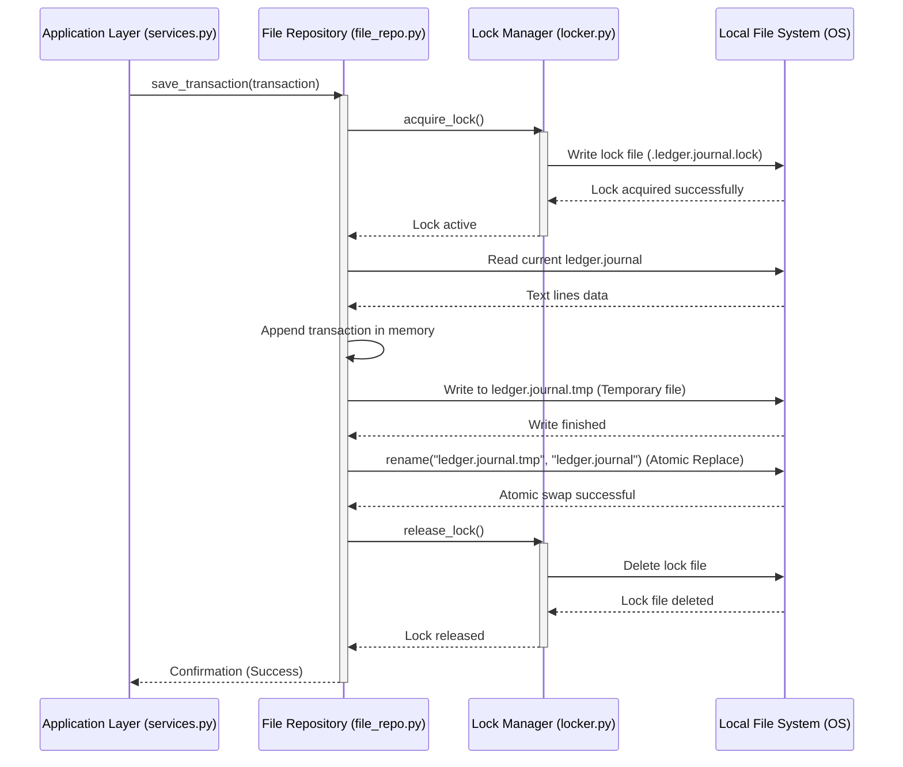

# **📋 Software Design Document: OrcaLogy — Local-First State-Managed Budget Ledger**

**Role:** Project Owner / System Architect

**Objective:** Detail the technical implementation, architectural patterns, frameworks, and deployment topologies required to execute the business vision.

**Context:** OrcaLogy — A local-first, terminal-centric personal and team budget management CLI/TUI tool designed to enforce the core business rules through a real-time deterministic Python execution engine and strict plain-text ledger files.

## **🏛️ Project Metadata**

- **Client / Segment:** Tech Professionals, Developers, and Small Teams (CLI-centric & Local-first Users)
- **Date of Creation:** June 15, 2026
- **Lead Architect:** Kalyel N. Laurindo / Software Engineer
- **Document Version:** v2.0

---

## **🛠️ 1. Technical Stack Overview**

### **1.1. Core Architectural Layers Form**

| **Layer**                   | **Technology/Framework**                   | **Technical Rationale**                                                                                                                                     |
| --------------------------- | ------------------------------------------ | ----------------------------------------------------------------------------------------------------------------------------------------------------------- |
| **Frontend / Client Stack** | Python `Textual`, `Typer`                  | `Textual` provides a rich, reactive TUI with CSS/grid layouts. `Typer` handles command-line arguments parsing and sub-commands with native autocompletion.  |
| **Backend Core Stack**      | Python (Version 3.11+)                     | High developer velocity, cross-platform distribution, and clean syntax. Enforced with `mypy` for strict type safety and `ruff` for fast linting/formatting. |
| **Database & Storage**      | `os`, `pathlib`, custom plain-text parsing | Eliminates database daemons. Stores transaction logs in a standardized plain-text journal file (`ledger.journal`).                                          |
| **Concurrency & Safety**    | `filelock`, `os.replace()`                 | `filelock` prevents concurrent write corruption. `os.replace()` executes atomic swaps on file replacement.                                                  |
| **Gateway & Infra**         | `pip` / `poetry` / PyPI                    | Easily distributed as a standard CLI tool or standalone package.                                                                                            |
| **Observability**           | Python `logging`                           | Writes execution details locally to `~/.config/orcalogy/logs/orca.log` using rotating log files.                                                            |

### **1.2. Technical Traceability Matrix (Pain Point ➔ Technical Module)**

| **Pain Point**                                     | **System Requirement ID** | **Responsible Technical Module**         |
| -------------------------------------------------- | ------------------------- | ---------------------------------------- |
| **Stealth Financial Leakage & Delayed Visibility** | RF01, RF03                | `domain.validation` and `domain.ranking` |
| **Manual Data Corruption & Overwritten Ledgers**   | RF02                      | `infra.file_repo` and `infra.locker`     |

---

## **🏗️ 2. Architectural Design & Core Patterns**

- **Field 2.1 - Core Architectural Pattern:** Hexagonal (Ports & Adapters) integrated with Domain-Driven Design (DDD) principles.

```
                   +-------------------------------------------------+
                   |                   Client Layer                  |
                   |      [TUI: Textual]       [CLI: Typer]          |
                   +--------------+-------------------+--------------+
                                  |                   |
                                  v                   v
                   +-------------------------------------------------+
                   |                Application Layer                |
                   |               [services.py (UC)]                |
                   +-----------------------+-------------------------+
                                           |
                                           v
                   +-------------------------------------------------+
                   |                   Domain Core                   |
                   |   [models.py]  [validation.py]  [ranking.py]    |
                   |              (Value Object: Money)              |
                   +-----------------------+-------------------------+
                                           |
                                           | (Implements Protocol)
                                           v
                   +-------------------------------------------------+
                   |               Infrastructure Layer              |
                   |  [file_repo.py]   [parser.py]   [locker.py]     |
                   +-----------------------+-------------------------+
                                           |
                                           v
                                   [ledger.journal]
```

### **💡 Architectural Pattern Details**

- **Field 2.2 - Design Pattern Description:**
  1. **Domain Core:** Fully isolated from inputs and storage. Core business rules are enforced inside pure dataclasses.
  2. **Application Layer:** Orchestrates dependencies using a simple container bootstrap (`bootstrap.py`) that binds the repository implementations dynamically.
  3. **Infrastructure Layer:** Handles physical constraints (concurrency file-locking, parsing files line-by-line, and executing atomic writing swaps).
  4. **Client Interface:** Uses CLI and TUI adapters to interface with the user.

### **2.3. Domain-Driven Design Improvements**

- **Value Object: `Money`**: Inside `domain.models`, money is wrapped inside a dedicated class that delegates mathematical operations directly to the Python standard library `Decimal` to ensure absolute precision.
- **Aggregate Root: `Budget`**: Encapsulates `BudgetCategory` structures and controls all mutations to enforce spending limits, verifying that a transaction violates category constraints _before_ it gets logged.

---

## **🔐 3. Security Architecture & Data Protection**

### **✍️ Security Specification Form**

| **Security Field**             | **Implemented Protocol / Standard**                                               |
| ------------------------------ | --------------------------------------------------------------------------------- |
| **Data In Transit**            | Local In-Memory execution (No network traffic).                                   |
| **Data At Rest Encryption**    | Integrates transparently with `gpg` binaries if encrypted journal files are used. |
| **Access Delegation Protocol** | File system level permission boundaries (`chmod 600` for Unix).                   |
| **Emergency Recovery Policy**  | Plain-text journals allow direct manual fixes using any editor.                   |

---

## **🧩 4. Evolutionary Blueprint (Scaling Path)**

- **Module Extraction Path A (Web Graphics):** Decouple Textual TUI and replace it with a lightweight `FastAPI` server driving a React or static local web dashboard.
- **Module Extraction Path B (Cloud Backups):** A Git-hook background utility that triggers automated Git commits and pushes when budgets close.

---

## **📐 5. System Component Diagram & Flow Dynamics**

### **5.1. Component Diagram**

```
graph TD
    subgraph Client_Layer [Client & Interfaces]
        CLI["Typer CLI Parser<br>(Ad-hoc Commands)"]
        TUI["Textual Interface<br>(Interactive TUI Dashboard)"]
    end

    subgraph Core_Backend_Component [OrcaLogy Core (Python)]
        subgraph Bootstrap_Inbound [Bootstrap Container]
            Boot["bootstrap.py<br>(Dependency Injection)"]
        end

        subgraph Ports_Inbound [Application Layer]
            UCLedger["services.py<br>(Use Cases Engine)"]
        end

        subgraph Domain_Layer [Domain Core]
            Engine["validation.py / ranking.py<br>(Rules & Calculations)"]
            Entities["models.py<br>(Budget, Money, Category)"]
        end

        subgraph Ports_Outbound [Infrastructure Layer]
            RepoInterface["ILedgerRepository<br>(typing.Protocol)"]
            FSAdapter["file_repo.py<br>(Persistence Adapter)"]
            LexParser["parser.py<br>(Lexical Journal Parser)"]
            LockManager["locker.py<br>(FileLock Concurrency Manager)"]
        end
    end

    subgraph OS_Storage [Local Filesystem]
        Config[("config.toml")]
        Ledger[("ledger.journal")]
        BackupLedger[("ledger.journal.bak")]
    end

    CLI -->|Asks Boot| Boot
    TUI -->|Asks Boot| Boot
    Boot -->|Instantiates| UCLedger
    UCLedger -->|Orchestrates| Engine
    Engine -->|Mutates| Entities
    UCLedger -->|Uses| RepoInterface

    RepoInterface -.->|Implemented by| FSAdapter
    FSAdapter -->|Delegates parsing| LexParser
    FSAdapter -->|Acquires| LockManager
    FSAdapter -->|Reads/Writes| Ledger
    FSAdapter -->|Backup Copies| BackupLedger
    FSAdapter -->|Parses| Config
```

### **5.2. Sequence Diagram: Atomic File Writing & Concurrency Lock**

This diagram illustrates how OrcaLogy prevents file corruption and race conditions across multiple open terminals.



---

## **📂 6. Data Architecture (Relational & Document Design)**

### **✍️ Data Architecture Form Entry**

- **Field 6.1 - Primary Database Schemas:**
  - **`config.toml`**: Contains metadata and limits configuration.
  - **`ledger.journal`**: Flat-text append-only transaction stream.

```
# format of ledger.journal
2026-06-15 | Food     | 25.50  | Supermarket          | #groceries
2026-06-16 | Lazer    | 120.00 | Cinema + Dinner      | #entertainment
```

- **Field 6.2 - Indexing & Optimization Strategy:**
  - Lexical pointer offset index built inside `infra.parser` scanning for new line characters to map months to byte offsets, avoiding sequential line iteration.

---

## **🚀 7. Continuous Integration, Deployment & QA**

- **Test-Driven Development (TDD) Cycle:** Domain constraints and overrun rankings are written and executed with tests before any terminal output displays are implemented.
- **Automated Architecture Guardrails:** Checked via `mypy --strict` for verification of types and `ruff` for linting.
- **Test Isolation Pyramid:**
  - **Unit Tests:** Business logic calculation.
  - **Integration Tests:** Concurrency testing utilizing mock multi-process writers competing for the file lock.

---

## **🎨 8. User Interface Design System (UI Architecture)**

- **Field 8.1 - Design Philosophy & Design Tokens:** Modern ANSI Colors.
  - _Red_ (#FF0000) for hard overrun states.
  - _Yellow_ (#FFFF00) for soft warning warnings (near limit).
  - _Green_ (#00FF00) for active budgets operating normally.

### **8.2. Interactive CLI Interfaces (Rich Renderings)**

#### **Command: `orca add` (Estouro de Limite com Validação)**

```
$ orca add --category "Lazer" --amount 150.00 --desc "Ingressos de Show"

⚠️  AVISO DE LIMITE EXCEDIDO (OVERRUN WARNING)
───────────────────────────────────────────────────────────────────────
Categoria:        Lazer
Limite Mensal:    R$ 300,00
Gasto Atual:      R$ 200,00
Lançamento Novo:  R$ 150,00
Projeção Final:   R$ 350,00 (Estouro de R$ 50,00)

[?] Deseja forçar o lançamento mesmo extrapolando o orçamento? (y/N): _
```

#### **Command: `orca report` (Deviations Ranking)**

```
$ orca report

📅 Orçamento: Junho 2026 (Status: ATIVO)
───────────────────────────────────────────────────────────────────────
  CATEGORIA    | LIMITE (R$) | GASTO (R$) | DESVIO (%) | STATUS
───────────────────────────────────────────────────────────────────────
  Lazer        |  300.00     |  350.00    |  +16.6%    | 🚨 ESTOURADO
  Alimentação  |  800.00     |  780.00    |   -2.5%    | ⚠️  ALERTA
  Transporte   |  200.00     |   80.00    |  -60.0%    | ✅ SEGURO
───────────────────────────────────────────────────────────────────────
  TOTAL        | 1300.00     | 1210.00    |   -6.9%    | ✅ DENTRO
```

---

### **8.3. Interactive TUI Interface (Textual Layout Mockup)**

Below is the conceptual layout schema of the Textual Dashboard.

```
┌──────────────────────────────────────────────────────────────────────────────────┐
│  ORCALOGY TUI  ──  Junho 2026 (Status: ATIVO)                    16:25:00        │
├──────────────────────────────────────┬───────────────────────────────────────────┤
│                                      │  CATEGORIAS (Ordenadas por Desvio)        │
│  ORÇAMENTO GERAL                     │  1. Lazer (Estouro: +16.6%)               │
│  ──────────────────────────────      │  ████████████████████████████  R$ 350/300 │
│  Limite Total:   R$ 1.300,00         │                                           │
│  Total Gasto:    R$ 1.210,00         │  2. Alimentação (Alerta: -2.5%)           │
│  Saldo Restante: R$ 90,00            │  ████████████████████████░░░░  R$ 780/800 │
│                                      │                                           │
│  [■■■■■■■■■■■■■■■■■■■■■■■■■■■■■■░]   │  3. Transporte (Seguro: -60.0%)           │
│  Adjacência ao limite: 93%           │  ██████████░░░░░░░░░░░░░░░░░  R$ 80/200   │
├──────────────────────────────────────┴───────────────────────────────────────────┤
│  HISTÓRICO RECENTE DE LANÇAMENTOS                                                │
│  • 2026-06-16 | Lazer       | R$ 120,00 | Cinema + Jantar                        │
│  • 2026-06-15 | Alimentação | R$ 45,50  | Supermercado da Esquina                │
│  • 2026-06-15 | Transporte  | R$ 15,00  | Uber Corrida                           │
├──────────────────────────────────────────────────────────────────────────────────┤
│  [F1] Lançar Despesa  │  [F2] Nova Categoria  │  [F3] Fechar Mês  │  [Q] Sair    │
└──────────────────────────────────────────────────────────────────────────────────┘
```

---

## **📂 9. Codebase Structure & Directory Standards**

- **Field 9.1 - Directory Strategy:** Clean Python modular architecture.

### **💡 Directory Layout Entry**

- **Field 9.2 - Codebase Directory Tree:**

```
orcalogy/
├── pyproject.toml              # Dependencies, Pytest, Ruff and Mypy configuration
├── README.md
├── orcalogy/                   # Main package source
│   ├── __init__.py
│   ├── main.py                 # Application entrypoint
│   ├── bootstrap.py            # Simple DI Container
│   ├── cli/                    # CLI Commands Layer
│   │   ├── __init__.py
│   │   └── commands.py
│   ├── tui/                    # TUI Desktop layout using Textual
│   │   ├── __init__.py
│   │   ├── app.py
│   │   └── screens.py
│   ├── app/                    # Application use cases Orchestrator
│   │   ├── __init__.py
│   │   └── services.py
│   ├── domain/                 # Core domain logic
│   │   ├── __init__.py
│   │   ├── models.py           # Dataclasses & Money Value Object
│   │   ├── validation.py       # Limits checks logic
│   │   ├── ranking.py          # Category deviation calculations
│   │   └── errors.py
│   └── infra/                  # Infrastructure Adapters
│       ├── __init__.py
│       ├── file_repo.py        # File storage & operations coordinator
│       ├── parser.py           # Flat ledger text parser
│       └── locker.py           # Advisory concurrency locking manager
└── tests/                      # Testing suites
    ├── __init__.py
    ├── conftest.py
    ├── test_domain.py
    └── test_infra.py
```

---

## **📝 10. Architecture Decision Records (ADR)**

- **ADR-001 (Language):** Python selected for faster development cycles and Textual/Typer compatibility.
- **ADR-002 (Storage Strategy):** Plain Text over SQL/SQLite. Fits developers' preferences. Fully human-readable.
- **ADR-003 (Concurrency):** Advisory file-level locking via `filelock`.
- **ADR-004 (Value Object representation):** Native `Decimal` wrapped in `Money` to prevent rounding anomalies.
- **ADR-005 (Graceful Concurrency Timeout Handling):** Map `filelock.Timeout` to a custom domain-level exception `LedgerConcurrencyError` to keep the domain clean of library dependencies, and handle it in UI adapters (CLI/TUI) to prevent raw tracebacks.


---

🏁 **End of Document:** System revisions and updates must be registered directly in this artifact.
